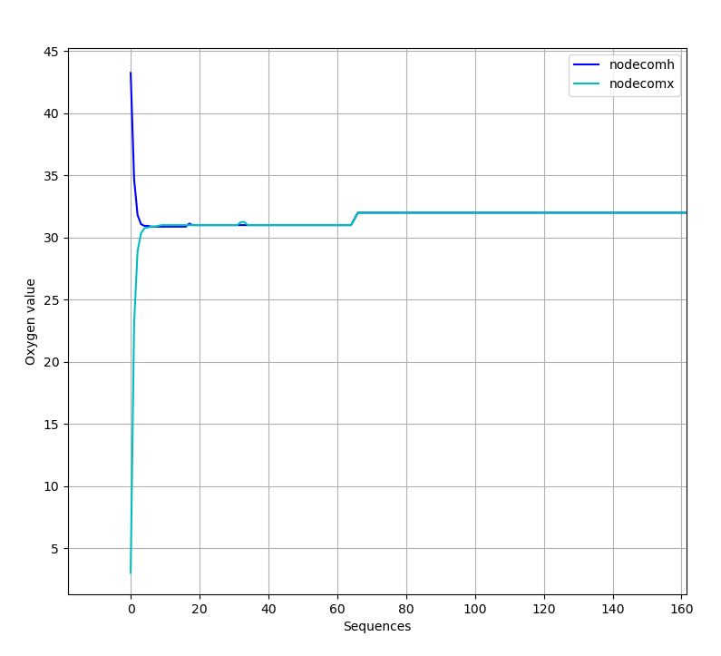
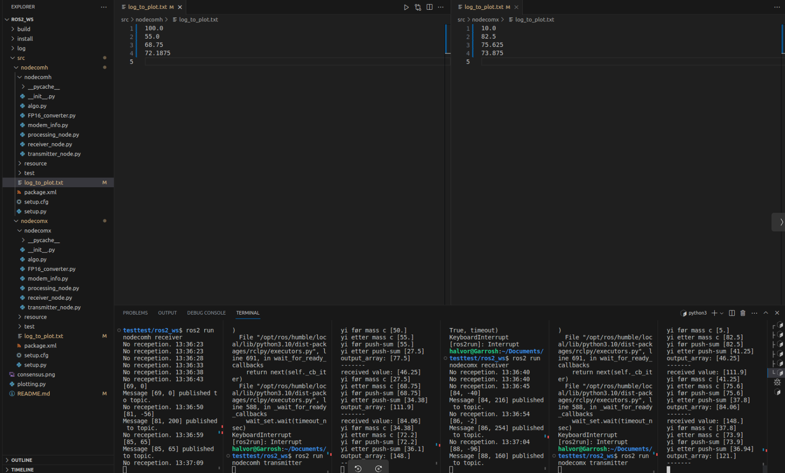

## Summary

This is a ROS 2 structure with a push-sum consensus between two nodes, impleme nted with a unet simulation. 


## About 

A code developed from a different ROS 2 structure https://github.com/Brovidius/ROS2_nodecomx where the ra-NRC was simplified down in the algo.py. Some functions still remains from the ra-nrc that doesn't need to be there, such as how the values are processed with converters etc., but due to limited time the consensus algorithm on algo.py was prioritized. The setup will still work, it will just go through some unneccesary steps.

## Important notes 

Since this includes float16 transmissions, some problems could occur due to the float16 rounding behavior. This is because our "mass counters" ($\sigma_i$ / $\rho_i$) gets so large. The higher the number, the worse of an approximation the float16 will make. This will cause shaky results after a certain number of transmissions. The results will be worse the higher the starting values since the mass counters will increase more rapidly. 

The folder setup is like this to illustrate how the plotting was setup, but the important part to take from this for further development is the package nodecomx in src which can be be added to the ROS project. Nodecomx and nodecomh runs the same stuff, just different starting values on the $y_i$ which is the value we want to come to a consensus. In reality only one nodecom is needed, but this is done to plot the results. 

Also, since this is a simulation, if you run both the nodes at once, they will send and receive at the same time and some weird stuff will happen. This is why only one nodecom is ran first, then after waiting some seconds, the second one is initialized. Now results will be more realistic. 

## Running the code

Before setting the ROS stuff up, the unet stack simulation has to be setup. A tutorial here: https://unetstack.net/handbook/unet-handbook_getting_started.htmlhttps://unetstack.net/handbook/unet-handbook_getting_started.html, in 2.1 Setting up a simple simulated network. What you do is to download the folder and run this folder in the terminal and write:

```
bin/unet samples/2-node-network.groovy
```

Then this will come up:

```
2-node network
--------------

Node A: tcp://localhost:1101, http://localhost:8081/
Node B: tcp://localhost:1102, http://localhost:8082/

```

If you download the whole ROS workspace, you may need to delete the folders "build", "install" and "log", then *colcon build* again in the terminal to get them back. 

To run the two nodes, 6 terminal windows were opened where every one was sourced (source install/local.setup.bash), then the following commands were ran in ~ros2_ws folder:

### For node 1

terminal 1
```
ros2 run nodecomx receiver
```
terminal 2
```
ros2 run nodecomx processing
```
terminal 3
```
ros2 run nodecomx transmitting 
```

### For node 2
terminal 4
```
ros2 run nodecomh receiver
```
terminal 5
```
ros2 run nodecomh processing
```
terminal 6
```
ros2 run nodecomh transmitting 
```

**Or one could create a ROS 2 launch file to launch each node with one command**

## The results



Where one sequence is a back and forth communication between the two nodes. As one can see the consensus works good the first sequences, then it will have a little offset. If you run this enough times, the mass counters will get large and it will crash and some weird stuff will happen.

## Example how it looks


After the values are filled up in the logs, plotting.py can be launched to see the plot.